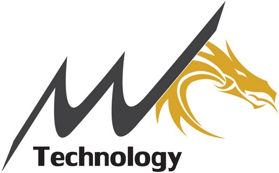

## ***Laos*** : System Administrator Appreciation Day ***2019***
+ Date : **Friday, July 26, 2019**
+ Venue : **Carlsberg Sports Bar by SunTara Escape**
- Agenda : 
  - 13:40 - 14:00 : **Registration**
  - 14:01 - 14:20 : **Welcome Note (*& Lucky Draw*)**, *Maykin Warasart*, (Microsoft MVP)
  - 14:21 - 15:30 : **Why SysAdmin need to concern about ISO27001 ?**, *Angkarn Pummarin* (Triple Nine Professional)
  - 15:31 - 16:20 : **Security Best Practices for Windows SysAdmin**, *Jedsada Thongkanluang* (T-NET Security)
  - 16:21 - 17:10 : **SysAdmin's hobby : How to make money from Microstock?**, *Siraphum Pechto* (#VolunteXTH)
  - 17:11 - 17:50 : **Volunteering connects you to others**, *Pemika Limpittaya* (#VolunteXTH)
  - 17:51 - 18:00 : **Closing (*& Lucky Draw*)**
 
 
- Workshop Sessions :
  - **How to make your site more stable like ____Hub.**, *Maykin Warasart*, (#VolunteXTH Founder)
  - **Vulnerability Assessment**, *Jedsada Thongkanluang* (T-NET Security)

- Official Supporters :

