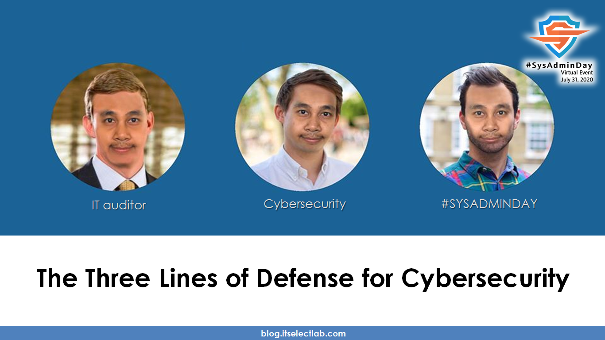
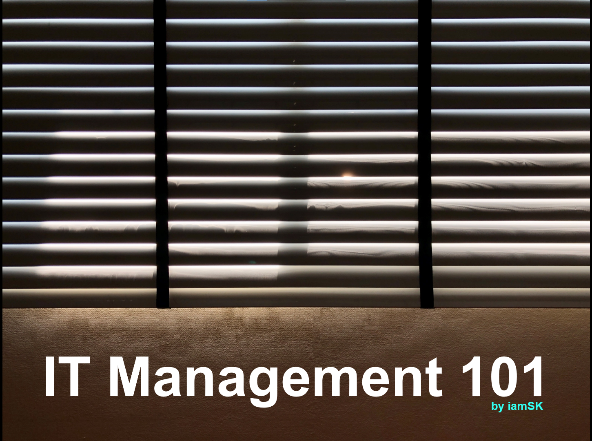

## ***Virtual Event*** : System Administrator Appreciation Day ***2020***
# **(*Friday*) July 31, 2020**

")

### Confirmed Speaker[s] [ [***Time Table : https://bit.ly/SysAdminDay2020VE***](https://bit.ly/SysAdminDay2020VE) ]
+ Khun [Narate Ketram](https://www.facebook.com/koonnarate)
+ Khun [Pongpat Rakdej](https://www.facebook.com/pongpatrakdej)
+ Khun [Damrongsak Reetanon](https://www.facebook.com/damrongsak)
+ Khun [Chonlatit Rujiphut](https://www.facebook.com/Tsunakun27)
+ Dr. [Pongpisit Wuttidittachotti](https://www.facebook.com/pongpisitwutti)
+ Khun [Somphop Krittayaworagul](https://www.facebook.com/SK.Unavailable)
+ Khun [Kumton Suttiraksiri](https://www.facebook.com/kumton.s)
+ Khun [Natthakan Puangroi](https://www.facebook.com/natthapete)
+ Khun [Warunyou Sunpachit](https://www.facebook.com/howdoyoufeel.kenji)

| From      |      To    |  Topic                                                   |
|:---------:|:----------:|:---------------------------------------------------------|
| 10:00 AM  |  10:30 AM  | IT Management 101                                        |
| 11:00 AM  |  11:30 AM  | Introduction to Vulnerability Assessment for SysAdmin    |
| 02:00 PM  |  03:00 PM  | Monitoring System - Prometheus and Grafana               |
| 07:30 PM  |  08:30 PM  | NGINX Ingress Controller for Kubernetes                  |
| 08:30 PM  |  09:00 PM  | The Framework for Improving Critical Infrastructure Cybersecurity |
| 09:00 PM  |  10:00 PM  | The Three Lines of Defense for Cybersecurity             |
| 10:30 PM  |  11:00 PM  | SSH Tips and Tricks for System Admin                     |

### [more info] : <maykin@owasp.org>, [@maykin](https://line.me/R/ti/p/%40maykin)

