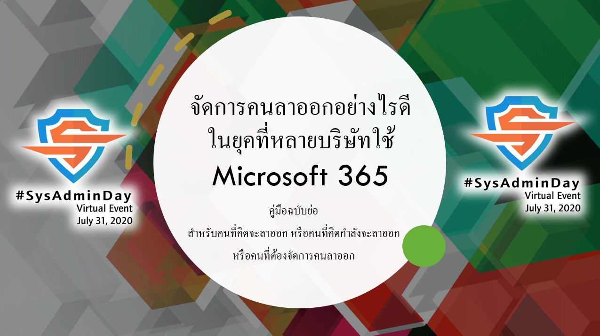

## ***Virtual Event*** : System Administrator Appreciation Day ***2020***
# **(*Friday*) July 31, 2020**

")

### Confirmed Speaker[s] [ [***Time Table : https://bit.ly/SysAdminDay2020VE***](https://bit.ly/SysAdminDay2020VE) ]
+ Khun [Narate Ketram](https://www.facebook.com/koonnarate)
+ Khun [Pongpat Rakdej](https://www.facebook.com/pongpatrakdej)
+ Khun [Damrongsak Reetanon](https://www.facebook.com/damrongsak)
+ Khun [Chonlatit Rujiphut](https://www.facebook.com/Tsunakun27)
+ Dr. [Pongpisit Wuttidittachotti](https://www.facebook.com/pongpisitwutti)
+ Khun [Somphop Krittayaworagul](https://www.facebook.com/SK.Unavailable)
+ Khun [Kumton Suttiraksiri](https://www.facebook.com/kumton.s)
+ Khun [Natthakan Puangroi](https://www.facebook.com/natthapete)
+ Khun [Warunyou Sunpachit](https://www.facebook.com/howdoyoufeel.kenji)
+ Pol.Lt.Col. [Manupat Sriboonlue](https://www.facebook.com/toto.innovation)

## Thread 1

| From    |    To    |  Topic                                                   |
|:-------:|:--------:|:---------------------------------------------------------|
| 10:00   |  10:30   | IT Management 101                                        |
| 11:00   |  11:30   | Introduction to Vulnerability Assessment for SysAdmin    |
| 13:00   |  13:30   | Active Shooter Survival - วิธีเอาตัวรอดจากสถานการณ์กราดยิง      |
| 14:00   |  15:00   | Monitoring System - Prometheus and Grafana               |
| 19:30   |  20:30   | NGINX Ingress Controller for Kubernetes                  |
| 20:30   |  21:00   | The Framework for Improving Critical Infrastructure Cybersecurity |
| 21:00   |  22:00   | The Three Lines of Defense for Cybersecurity             |
| 22:30   |  23:00   | เอสเอสเฮ็ด อิหยังวะ \| SSH Tips and Tricks for System Admin    |
| 23:00   |  23:30   | จัดการคนลาออกอย่างไรดี ในยุคที่หลายบริษัทใช้ Microsoft 365          |

## Thread 2

| From     |    To    |  Topic                                                   |
|:--------:|:--------:|:---------------------------------------------------------|
| 21:00    |  N/A     | The Personal Data Protection Act B.E. 2562 (2019) (“PDPA”) of Thailand 101 |

[ (“PDPA”) of Thailand 101")](https://www.facebook.com/pmaeklong/posts/10221045554862437)

### [more info] : <maykin@owasp.org>, [@maykin](https://line.me/R/ti/p/%40maykin)

