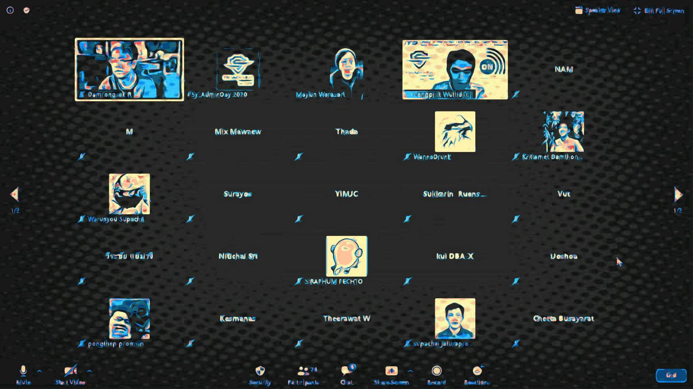

## ***Virtual Event*** : System Administrator Appreciation Day ***2021***
# **(*Friday*) July 30, 2021** --- *#DuringCOVID19*

### Confirmed Speaker[s] [***Time Table : https://bit.ly/SysAdminDay2021***](https://bit.ly/SysAdminDay2021)
+ Khun [Thanyapon Sananakin](https://www.facebook.com/thanyapon)
+ Khun [Natthakan Puangroi](https://www.facebook.com/mayplepete)

## Thread 1

| From  |    To    |  Topic                                                   |
|:-----:|:--------:|:---------------------------------------------------------|
| 09:00 |  09:30   | **"How to build Gitlab-Runner on Docker"** by **Khun Natthakan Puangroi**|

## Thread 2

| From  |    To    |  Topic                                                   |
|:-----:|:--------:|:---------------------------------------------------------|
| xx:xx |  xx:xx   | TBA................................................      |

## Thread 3

| From  |    To    |  Topic                                                   |
|:-----:|:--------:|:---------------------------------------------------------|
| xx:xx |  xx:xx   | TBA................................................      |

### [more info] : <maykin@owasp.org>, [@maykin](https://line.me/R/ti/p/%40maykin)

