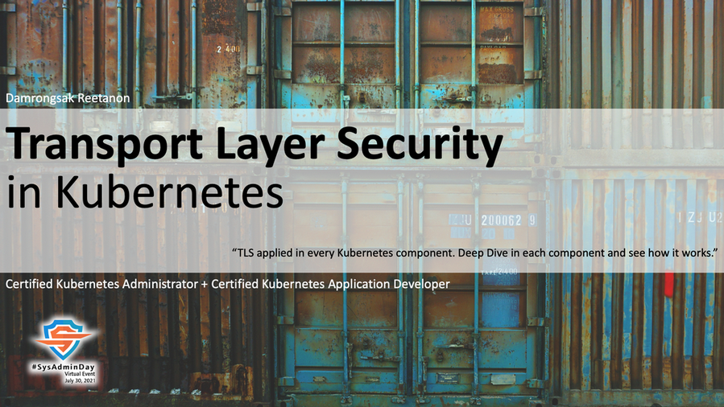

## ***Virtual Event*** : System Administrator Appreciation Day ***2021***
# **(*Friday*) July 30, 2021**

")

### Confirmed Speaker[s] 
+ **[09:30 - 10:00]** - **"PowerShell: Automation Strategy for Cloud Environment"**,  Khun [Thanyapon Sananakin](https://www.facebook.com/thanyapon), *Link will be provided soon*  

+ **[10:00 - 11:00]** - **"Transport Layer Security in Kubernetes"**, *TLS applied in every Kubernetes component. Deep dive in each component and see how it works.)*,  Khun [Damrongsak Reetanon](https://www.facebook.com/damrongsak), *Link will be provided soon*  

+ **[Cancelled: Pandemic]** - **"How to build Gitlab-Runner on Docker"**,  Khun [Natthakan Puangroi](https://www.facebook.com/mayplepete)

### [more info] : <maykin@owasp.org>, <maykin@ieee.org>, [@maykin](https://line.me/R/ti/p/%40maykin)

---

* [SysAdminDay 2020](/2020/VirtualEvent), Virtual Event
* [SysAdminDay 2019](/2019/Laos) at Lao PDR
* [SysAdminDay 2017](https://www.facebook.com/sysadminthailand/photos/?tab=album&album_id=303193886821648), Powered by [Netway Communication](https://netway.co.th/)

---

