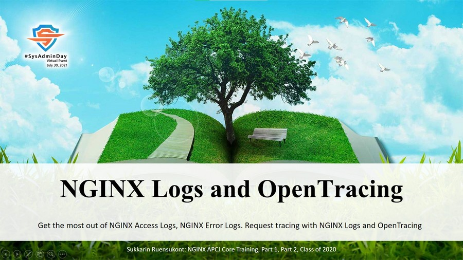
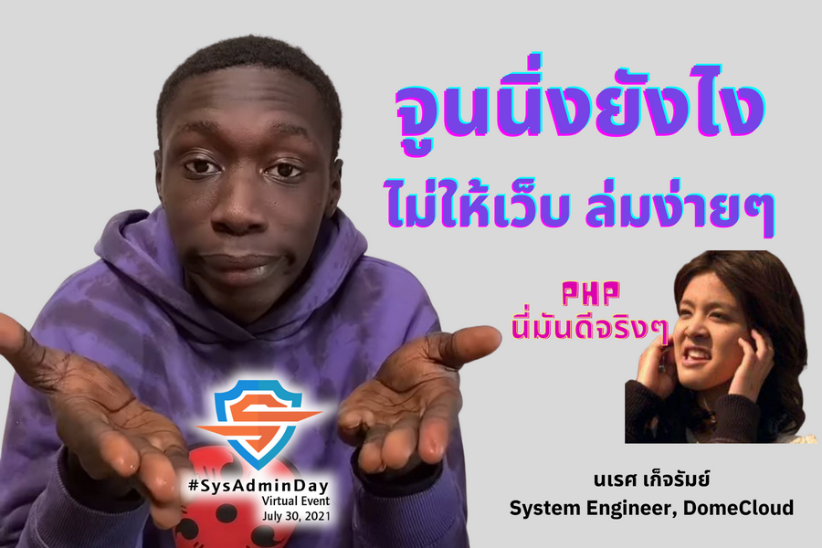

## ***Virtual Event*** : System Administrator Appreciation Day ***2021***
# **(*Friday*) July 30, 2021**
")
## \[Schedule\] <!--https://bit.ly/SysAdminDay2021-->
+ **[04:00 - 04:30]** - **"IT Pro Appreciation Happy Hour"**, *Announce the winners of the MV(IT)P Sweeps.* 
CompTIA Youtube Live: [https://www.youtube.com/watch?v=9lSXMG66MyE](https://www.youtube.com/watch?v=9lSXMG66MyE) 

+ **[08:15 - 08:30]** - **"Opening"**, [Maykin Warasart](https://www.facebook.com/maeklong) 

+ **[09:30 - 10:00]** - **"PowerShell: Automation Strategy for Cloud Environment"**,  Khun [Thanyapon Sananakin](https://www.facebook.com/thanyapon) \[**[Video](https://youtu.be/SnUgWSVOcXg)**\], \[**[PowerShell Scripts](Topics/PowerShell.zip)**\]
 

+ **[10:00 - 11:00]** - **"Transport Layer Security in Kubernetes"**, *TLS applied in every Kubernetes component. Deep dive in each component and see how it works.)*,  Khun [Damrongsak Reetanon](https://www.facebook.com/damrongsak) \[**[Video](https://youtu.be/MNLyuAvh-tA)**\] \[[แก้ไข](https://youtu.be/_WF-JoT5kUM)\]
 

+ **[11:00 - 12:00]** - **"NGINX Logs and OpenTracing"**, *Get the most out of NGINX Access Logs, NGINX Error Logs. Request tracing with NGINX Logs and OpenTracing.*,  Khun [Sukkarin Ruensukont](https://www.facebook.com/lifescompanion) \[**[Video](https://youtu.be/DZmGrXsCu8c)**\]
 

+ **[14:00 - 17:00]** - ***Break*** 

<a name="Future-of-Cybersec">
+ **[18:00 - 19:00]** - **"The Future of Cybersecurity Trends for 2021 and Beyond *(Open Discussion)*"**,  
Dr.[Pongpisit Wuttidittachotti](https://www.facebook.com/pongpisitwutti) Khun [Chonlatit Rujiphut](https://www.facebook.com/LuxFerrer7Sins)  Khun [Pongsak Yodjai](https://www.facebook.com/iampongsak) Khun [Sumedt Jitpukdebodin](https://www.facebook.com/sumedt.jitpukdebodin) Khun [Damrongsak Reetanon](https://www.facebook.com/damrongsak)  Khun [Chonwat Ngamlertprasert](https://www.facebook.com/age.ngam) & [Maykin Warasart](https://www.facebook.com/maeklong) \[**[Video](https://youtu.be/2wyXR5yGvS4)**\]
[")](https://www.facebook.com/maeklong/posts/10223578270978757)
 

+ **[19:00 - 20:00]** - **"Record of Processing Activities (ROPA)"**,  
Khun [Suwannachot Sirimahasal](https://www.facebook.com/discovery.kwang) 
\[**[Video](https://youtu.be/cpoNftgGFhM)**\]
[")](https://www.facebook.com/maeklong/posts/10223577246113136) 

+ **[20:00 - 21:00]** - **"จูนนิ่งยังไง ไม่ให้เว็บล่มง่ายๆ"**,  Khun [Narate Ketram](https://www.facebook.com/koonnarate) \[**[Google Meet](https://meet.google.com/syx-xxzr-ytx)**\] \[**[GitHub](https://github.com/narate/sys-admin-day-2021)**\]
 

+ **[Cancelled due to pandemic]** - **"How to build Gitlab-Runner on Docker"**,  Khun [Natthakan Puangroi](https://www.facebook.com/mayplepete)

---

### [more info] : <maykin@owasp.org>, <maykin@ieee.org>, [@maykin](https://line.me/R/ti/p/%40maykin)

---

* [SysAdminDay 2020](/2020/VirtualEvent), Virtual Event
* [SysAdminDay 2019](/2019/Laos) at Lao PDR
* [SysAdminDay 2017](https://www.facebook.com/sysadminthailand/photos/?tab=album&album_id=303193886821648), Powered by [Netway Communication](https://netway.co.th/)

---

