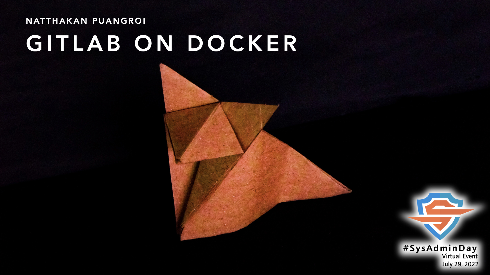

## ***Virtual Event*** : System Administrator Appreciation Day ***2022***
# **(*Friday*) July 29, 2022**
<!-- ")-->

    

    
[ <a target="_blank" href="./SysAdminDay2022.ics"><b>iCalendar</b></a> ]
[ <a target="_blank" href="http://www.google.com/calendar/event?action=TEMPLATE&dates=20220729T013000Z%2F20220729T151500Z&ctz=Asia/Bangkok&text=Virtual%20Event%20%3A%20SysAdmin%20Day%202022&location=&details=For%20details%2C%20link%20here%3A%20https%3A%2F%2FSysAdminDay.GitHub.io%2F2022%2FVirtualEvent"><b>Google Calendar</b></a> ]

| From    |    To    |  Topic                                                |
|:-------:|:--------:|:------------------------------------------------------|
| 08:45   |  09:00   | <b>Opening</b> (& <b>Lucky Draw</b>) -- Maykin Warasart & [iKNEX](https://www.iknex.or.th) |
| 09:01   |  09:20   | "<b>Boost your technical skills with Microsoft Learn and GitHub Skills</b>" -- Khun [Phantip Kokilanon](https://www.facebook.com/phantipk) [[<b>MS Teams</b>](https://aka.ms/SysAdminDayTH)]  |
| 09:21   |  10:00   | N/A
| 10:01   |  11:00   | "<b>How CSA help shaping proper cloud services through CCSK and CCM</b>" -- Khun [Tanat Tonguthaisri](https://www.facebook.com/epicure) [<b>Google Meet</b>]|
| 11:01   |  12:00   | "<b>Isolate Multiple Ingress Resources and Policies Using Ingress Class in Kubernetes</b>" (การใช้ Multiple Ingress และ Multiple separated policies ภายใต้ One Kubernetes Cluster)  -- Khun [Sukkarin Ruensukont](https://www.facebook.com/lifescompanion) [<b>Zoom</b>]   |
| 12:01   |  13:00   | "<b>What is the difference between penetration test and smart contract audit?</b>" -- Khun [Sumedt Jitpukdebodin](https://www.facebook.com/sumedt.jitpukdebodin)                                                      |
| 13:01   |  14:00   | N/A |
| 14:01   |  14:30   | "<b>Your Data-Driven Career Path: Turning data into information</b>"  -- Dr.h.c. [Charles Singh](https://www.facebook.com/JoeXSlovak) [<b>Zoom</b>] |
| 14:31   |  15:30   | "<b>MySQL Performance Tuning</b>"  -- Khun [Kittirak Moungmingsuk](https://www.facebook.com/kittirak) [<b>Zoom</b>]|
| 15:31   |  17:00   | N/A                                                   |
| 17:01   |  18:00   | "<b>Log</b>" (2564 & PDPA preparation)  -- Khun [Jedsada Thongkanluang](https://www.facebook.com/tomcisco) |
| 18:01   |  18:30   | "<b>Into the blue</b>" (พูดถึง Roles and Responsibilities ของ Blue Team และ Experience sharing การสอบ Blue Team Security LV1)  -- Khun [Chonlatit Rujiphut](https://www.facebook.com/LuxFerrer7Sins) [<b>Google Meet</b>]   |
| 18:31   |  19:00   | N/A                                                   |
| 19:01   |  20:00   | "<b>When you create the ClusterIP service in Kubernetes, what happens to the iptables rules?</b>" (เรียนรู้การทำงานของ Netfilter Framework จาก iptables rules ของการเข้าถึง Pods ใน Kubernetes ผ่านจากทาง Services ชนิดต่าง ๆ)  -- Khun [Damrongsak Reetanon](https://www.facebook.com/damrongsak) [<b>Zoom</b>] |
| 20:01   |  20:30   | "<b>GitLab on Docker</b>" -- Khun [Natthakan Puangroi](https://www.facebook.com/mayplepete) [<b>Zoom</b>]  |
| 20:31   |  21:00   | "<b>Zero Trust Security</b>" -- Khun [Wilasinee Rueangaram](https://www.facebook.com/InfoSecThaiGirl) [<b>Google Meet</b>]  |
| 21:01   |  22:00   | "<b>System Monitoring</b>"  -- Khun [Narate Ketram](https://www.facebook.com/koonnarate) |
| 22:01   |  22:15   | <b>Closing</b> (& <b>Lucky Draw</b>)                                                   |

    [ <a target="_blank" href="./SysAdminDay2022.ics"><b>iCalendar</b></a> ]
    [ <a target="_blank" href="http://www.google.com/calendar/event?action=TEMPLATE&dates=20220729T013000Z%2F20220729T151500Z&ctz=Asia/Bangkok&text=Virtual%20Event%20%3A%20SysAdmin%20Day%202022&location=&details=For%20details%2C%20link%20here%3A%20https%3A%2F%2FSysAdminDay.GitHub.io%2F2022%2FVirtualEvent"><b>Google Calendar</b></a> ]

#### More info -> [Maykin W.](https://line.me/R/ti/p/%40maykin)

---

* [SysAdminDay 2021](/2021/VirtualEvent), Virtual Event
* [SysAdminDay 2020](/2020/VirtualEvent), Virtual Event
* [SysAdminDay 2019](/2019/Laos) at Lao PDR
* [SysAdminDay 2017](https://www.facebook.com/sysadminthailand/photos/?tab=album&album_id=303193886821648), Powered by [Netway Communication](https://netway.co.th/)

#### Our supporter(s)
* [<b>บริษัท เคิร์ส คอร์ปอเรชั่น จำกัด - KIRS Corporation Company Limited</b>](https://www.facebook.com/kirscorp/)
* [<b>CompTIA Thailand</b>](https://www.facebook.com/comptiathailand/)

    
      
    
          
    

