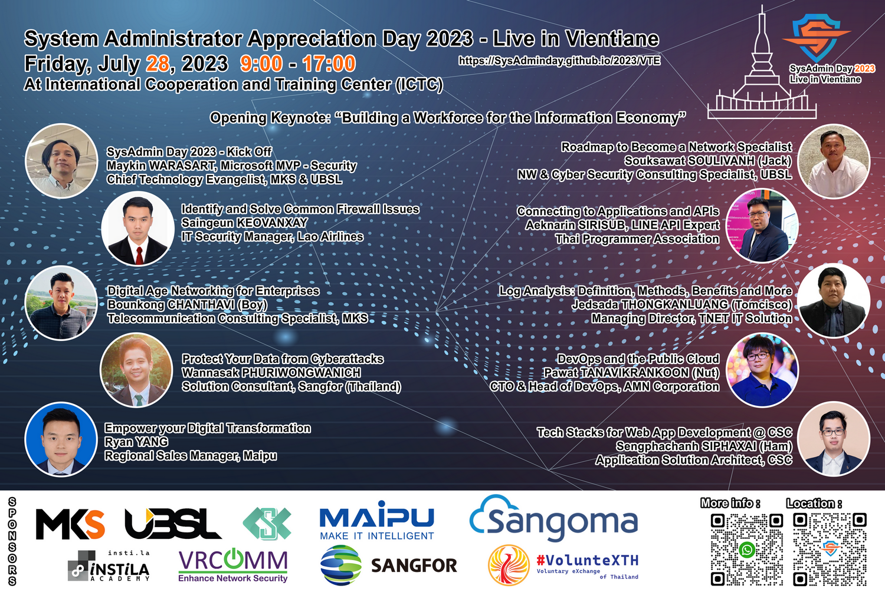

## System Administrator Appreciation Day ***2023*** - Live in Vientiane
# **(*Friday*) July 28, 2023**
### At International Cooperation and Training Center (ICTC) - *[[Map](https://goo.gl/maps/crqWGbgzDDJ4biyo9)]*

 

    

 

[ <a target="_blank" href="http://www.google.com/calendar/event?action=TEMPLATE&dates=20230728T020000Z%2F20230728T093000Z&ctz=Asia/Vientiane&text=SysAdmin%20Day%202023%20%3A%20Live%20in%20Vientiane&location=ICTC ສູນການຝຶກອົບຮົມຮ່ວມມືສາກົນ&details=For%20details%2C%20link%20here%3A%20https%3A%2F%2FSysAdminDay.github.io%2F2023%2FVTE"><b>Google Calendar</b></a> ]
[ <a target="_blank" href="./SysAdminDay2023-VTE.ics"><b>iCalendar</b></a> ]

| From  |  To   |  Topic                                                                                                                                     |
|:-----:|:-----:|:-------------------------------------------------------------------------------------------------------------------------------------------|
| 09:00 | 09:15 | *<b>Registration & Lucky Draw</b>*                                                                                                         |
| 09:15 | 09:30 | <b>SysAdmin Day 2023 - Kick Off</b> [Maykin Warasart, Microsoft MVP (Security)](https://mvp.microsoft.com/en-us/PublicProfile/5002869) *Chief Technology Evangelist, MKS & UBSL*                         |
| 09:30 | 09:40 | <b>Opening Keynote - "Building a Workforce for the Information Economy"</b> [Dr.Veerasith WONGKARN (Petch)](https://www.linkedin.com/in/veerasith/) *Chief Revenue Officer, MKS & UBSL*|
| 09:40 | 10:20 | <b>"Roadmap to Become a Network Specialist"</b> [Souksawat SOULIVANH (Jack)](https://www.linkedin.com/in/souksawat-soulivanh/) *Network & Cybersecurity Consulting Specialist, UBSL*   |
| 10:20 | 10:40 | *<b>Coffee Break</b>*                                                                                                                      |
| 10:40 | 11:20 | <b>"Identify and Solve Common Firewall Issues"</b> [Saingeun KEOVANXAY](https://www.facebook.com/profile.php?id=100084744435960) *IT Security Manager, Lao Airlines*                            |
| 11:20 | 12:00 | <b>"Connecting to Applications and APIs"</b> [Aeknarin Sirisub](https://www.facebook.com/swodsman) *Thai Programmer Association*                                          |
| 12:00 | 13:00 | *<b>Lunch Break</b>*                                                                                                                       |
| 13:00 | 13:35 | <b>"Digital Age Networking for Enterprises"</b> [Bounkong chanthavi (Boy)](https://www.linkedin.com/in/bounkong-chanthavi/) *Telecommunication Consulting Specialist, MKS*             |
| 13:35 | 14:15 | <b>"Log Analysis: Definition, Methods, Benefits and More"</b> [Jedsada Thongkanluang (Tomcisco)](https://www.facebook.com/tomcisco) *Managing Director, TNET IT Solution* | 
| 14:15 | 14:25 | *<b>Coffee Break</b>*                                                                                                                      |
| 14:25 | 15:05 | <b>"DevOps and the Public Cloud"</b> [Pawat Tanavikrankoon (Nut)](https://www.facebook.com/NutNutNutNutNut) *CTO & Head of DevOps, AMN Corporation*                              |
| 15:05 | 15:45 | <b>"Protect Your Data from Cyberattacks"</b> [Wannasak Phuriwongwanich (Aerk)](https://www.facebook.com/aerkwannasak) *Solution Consultant,  Sangfor (Thailand)*                     |
| 15:45 | 16:15 | <b>"Empower your Digital Transformation"</b> [Ryan Yang](https://www.linkedin.com/in/ryan-yang-443993128/) *Regional Sales Manager, Maipu* |
| 16:15 | 16:50 | <b>"Tech Stacks for Web App Development @ CSC"</b> [Sengphachanh SIPHAXAI (Ham)](https://www.linkedin.com/in/sengphachanh-siphaxai-622652254/) *Application Solution Architect, CSC*                       |
| 16:50 | 17:00 | *<b>Lucky Draw & Closing</b>*                                                                                                              |

    [ <a target="_blank" href="http://www.google.com/calendar/event?action=TEMPLATE&dates=20230728T020000Z%2F20230728T093000Z&ctz=Asia/Vientiane&text=SysAdmin%20Day%202023%20%3A%20Live%20in%20Vientiane&location=ICTC ສູນການຝຶກອົບຮົມຮ່ວມມືສາກົນ&details=For%20details%2C%20link%20here%3A%20https%3A%2F%2FSysAdminDay.github.io%2F2023%2FVTE"><b>Google Calendar</b></a> ]
    [ <a target="_blank" href="./SysAdminDay2023-VTE.ics"><b>iCalendar</b></a> ]

#### More info: 
+ Maykin [(LiNE)](https://line.me/R/ti/p/%40maykin)
+ Jack [(WhatsApp)](https://wa.me/qr/ZIXUWJ53MMJBP1)

#### Our supporter(s)

      
      
      
     
     
      
      
      
    

 
---

* SysAdminDay 2023, [Virtual Event](/2023/VirtualEvent)
* [SysAdminDay 2022](/2022/VirtualEvent), Virtual Event
* [SysAdminDay 2021](/2021/VirtualEvent), Virtual Event
* [SysAdminDay 2020](/2020/VirtualEvent), Virtual Event
* [SysAdminDay 2019](/2019/Laos) at Lao PDR
* [SysAdminDay 2017](https://www.facebook.com/sysadminthailand/photos/?tab=album&album_id=303193886821648), Powered by [Netway Communication](https://netway.co.th/)
