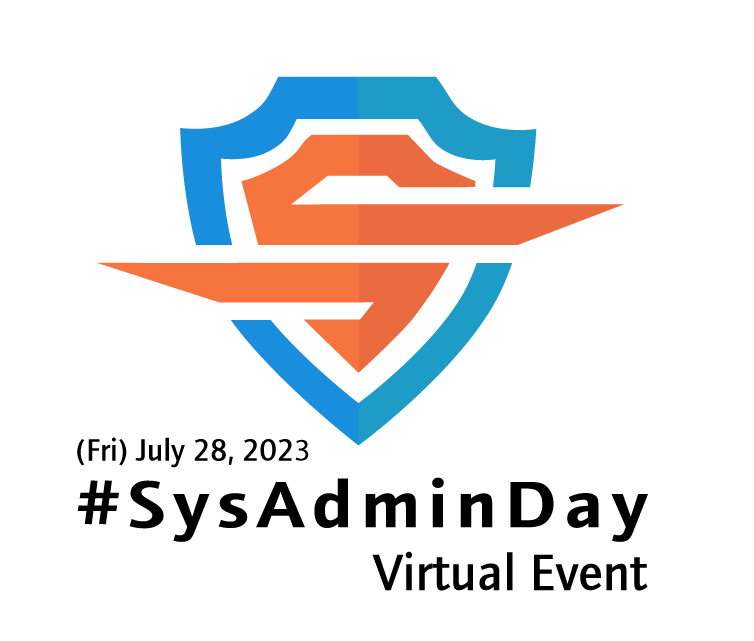
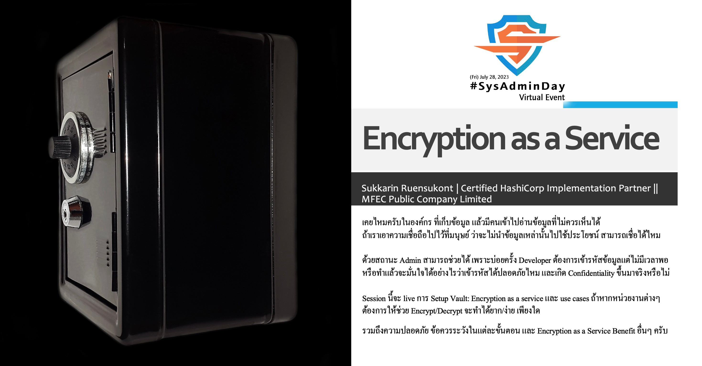
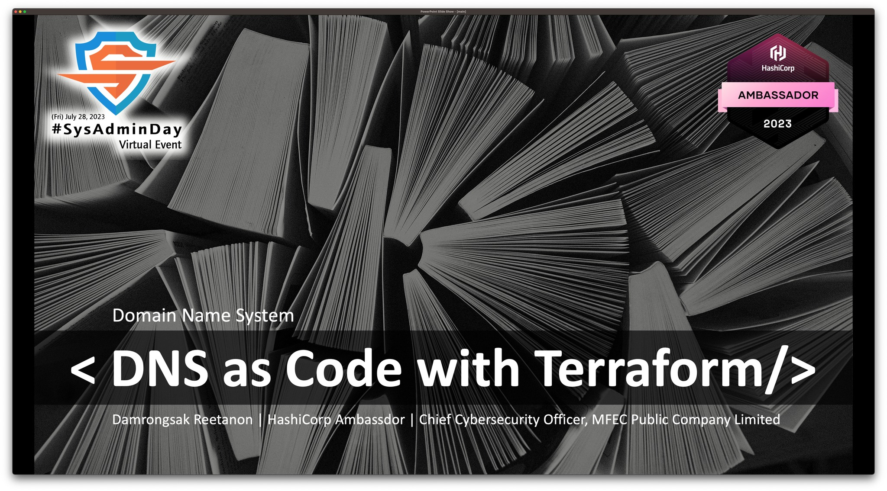
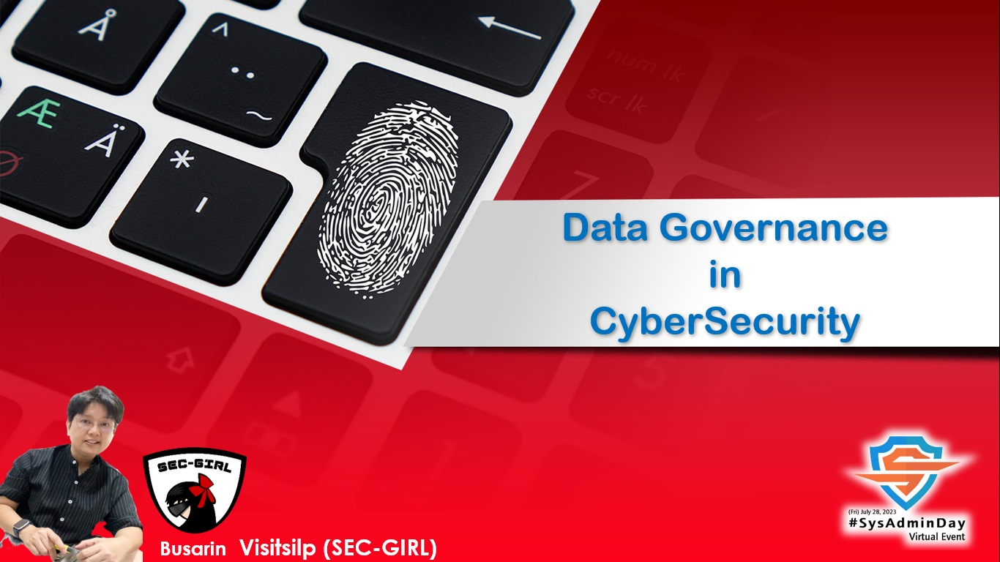
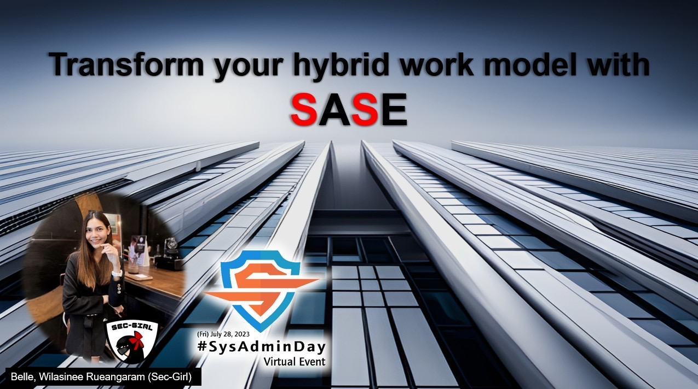
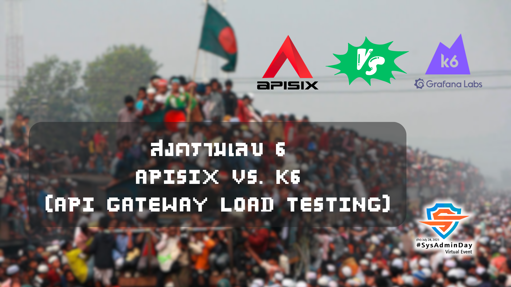

## ***Virtual Event*** : System Administrator Appreciation Day ***2023***
# **(*Friday*) July 28, 2023**

    

| From    |    To    |  Topic                                                                                                                                                                                                                                                                                         |    
|:-------:|:--------:|:-----------------------------------------------------------------------------------------------------------------------------------------------------------------------------------------------------------------------------------------------------------------------------------------------|    
| 17:45   |  18:00   | <b id="Maykin">Greeting</b> ---- [Maykin Warasart](https://mvp.in.th), [iKNEX (Thailand)](https://iknex.or.th)                                                                                                                                                                              |    
| 18:00   |  18:30   | <b id="Sukkarin">"Let Vault encrypt that for you, encryption as a service by Vault"</b> ---- Khun [Sukkarin Ruensukont](https://www.facebook.com/lifescompanion), Vault Certified HashiCorp Implementation Partner, [MFEC](https://www.mfec.co.th/)   |    
| 18:30   |  19:00   | <b id="Arnan">TBD</b> ---- Khun [Arnan Mindang](https://www.facebook.com/toomtam.cpe), [Opsta (Thailand) Co., Ltd.](https://www.opsta.co.th/)                                                                                                                                               |    
| 19:00   |  20:00   | <b id="Damrongsak">"Domain Name System as Code with Terraform"</b> ---- Khun [Damrongsak Reetanon](https://www.facebook.com/damrongsak), HashiCorp Ambassador                                                                                       |    
| 20:00   |  20:30   | <b id="Busarin">"Data Governance in Cyber Security"</b> ---- Khun [Busarin Visitsilp](https://www.facebook.com/koy.loveking), [SEC-GIRL](https://www.facebook.com/InfoSecThaiGirl)                                                                     |    
| 20:30   |  21:00   | <b id="Wilasinee">"Transform your hybrid work model with SASE"</b> ---- Khun [Wilasinee Rueangaram](https://www.facebook.com/belleeyyyy), [SEC-GIRL](https://www.facebook.com/InfoSecThaiGirl)                                                       |    
| 21:30   |  22:00   | <b id="Narate">"สงครามเลข 6 - APISIX vs. K6 (API Gateway Load Testing)"</b> ---- Khun [Narate Ketram](https://www.facebook.com/koonnarate), [DomeCloud](https://dome.cloud/)                                                                             |    
| 22:00   |  ...     | <b>Closing</b>                                                                                                                                                                                                                                                                                 |    

#### More info: [Maykin W.](https://line.me/R/ti/p/%40maykin)

---

* SysAdminDay 2023, [Live in Vientiane](/2023/VTE)
* [SysAdminDay 2022](/2022/VirtualEvent), Virtual Event
* [SysAdminDay 2021](/2021/VirtualEvent), Virtual Event
* [SysAdminDay 2020](/2020/VirtualEvent), Virtual Event
* [SysAdminDay 2019](/2019/Laos) at Lao PDR
* [SysAdminDay 2017](https://www.facebook.com/sysadminthailand/photos/?tab=album&album_id=303193886821648), Powered by [Netway Communication](https://netway.co.th/)

#### Our supporter(s)

    

