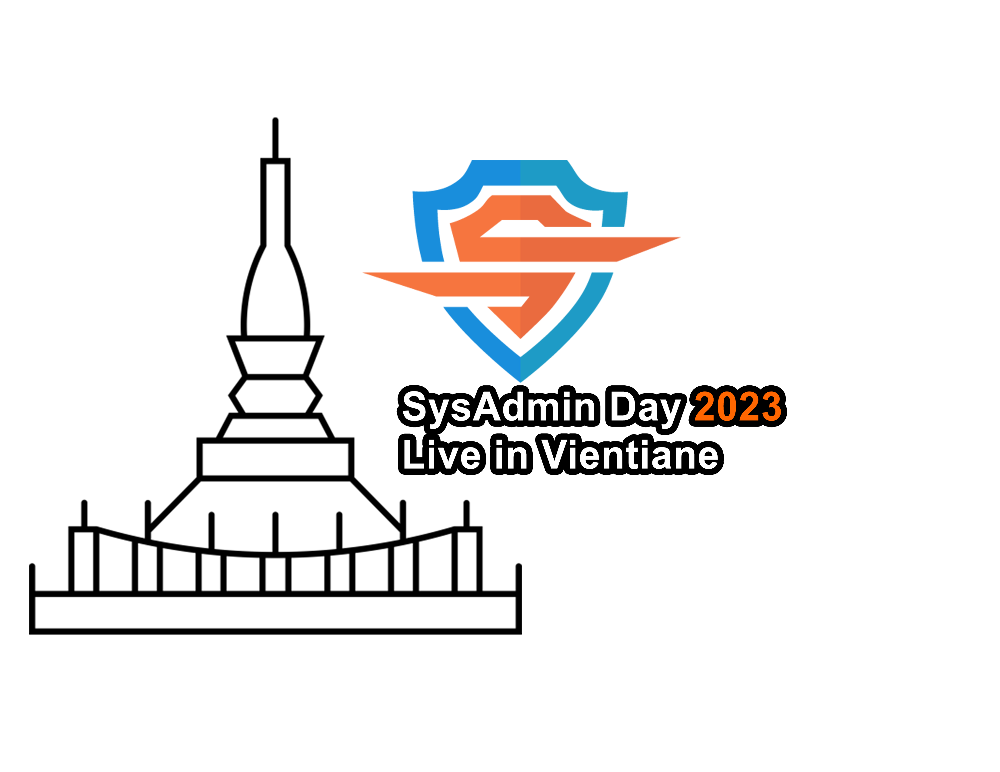
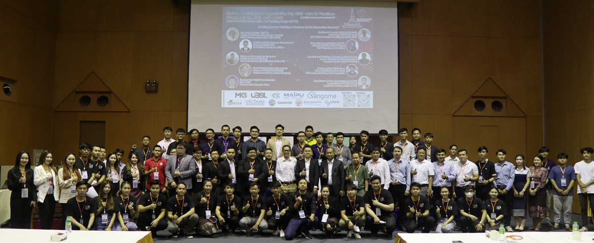
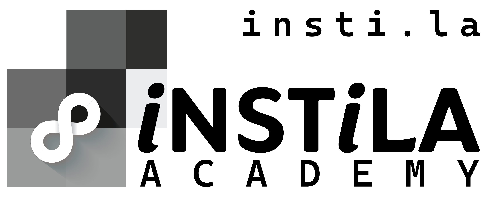
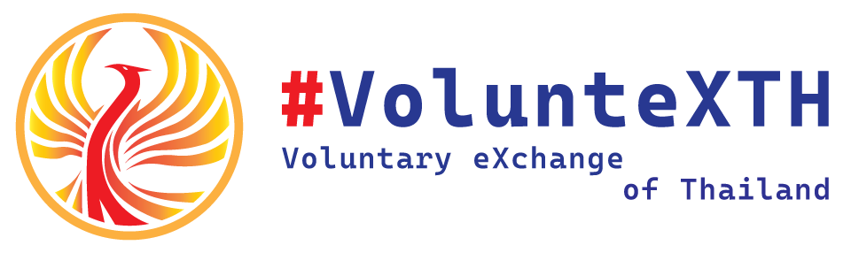

## SysAdmin Day ***2024*** - Live in Vientiane : Multiverse of IT 
# **(*Friday*) July 26, 2024**
### Location : TBD

 

    <!--  -->
    Waiting...

    Waiting...

[ <a target="_blank" href="http://www.google.com/calendar/event?action=TEMPLATE&dates=20240726T020000Z%2F20240726T093000Z&ctz=Asia/Vientiane&text=SysAdmin%20Day%202023%20%3A%20Live%20in%20Vientiane&location=TBD&details=For%20details%2C%20link%20here%3A%20https%3A%2F%2FSysAdminDay.github.io%2F2023%2FVTE"><b>Google Calendar</b></a> ]
[ <a target="_blank" href="./SysAdminDay2024-VTE.ics"><b>iCalendar</b></a> ]

| From  |  To   |  Topic                                                                                                                                                                                                          |
|:-----:|:-----:|:----------------------------------------------------------------------------------------------------------------------------------------------------------------------------------------------------------------|
| 08:45 | 09:15 | *<b>Registration </b>*                                                                                                                                                                                          |
| 09:15 | 09:30 | *<b>Opening Speech</b>* --*TBD*                                                                                                                                                                              |
| xx:xx | xx:xx | *<b>Easy way(s) to improve (y)ourself &amp; boost (y)our career(s) at a low cost w/ IT Cert(s)</b>* --*[Maykin Warasart](https://mayk.in/)* --- Founding President, iKNEX --- Microsoft MVP (Security) |
| xx:xx | xx:xx | *<b>How Bodybuilding made me a better IT Pro</b>* --*[Souksawat SOULIVANH (Jack)](https://www.linkedin.com/in/souksawat-soulivanh/)*  --- Verisette                                                       |
| xx:xx | xx:xx | *<b>Benefits of Golf for IT Pro</b>* --*[Bounkong CHANTHAVI (Boy)](https://www.linkedin.com/in/bounkong-chanthavi/)*  --- Telecommunication Consulting Specialist, MKS                                    |
| xx:xx | xx:xx | *<b>The risk of not having administrative control</b>* --*Angkarn Pummarin (Man)*  --- Deputy Managing Director, TNET IT Solution                                                                         |
| xx:xx | xx:xx | *<b>User Experience (UX) and Why Does It Matter?</b>* --*[Sayphet KEOVANXAY](https://www.linkedin.com/in/sayphet-keovanxay-aa1649254/)*  --- Sr. Business Analyst & Product Owner, CSC Lao                                                                            |
| 16:50 | 17:00 | *<b>Closing</b>*                                                                                                                                                                                                |

* A free consultation is available if you (who want to be a speaker at this event) need to boost your confidence in delivering your topic smoothly. [click](#consultant)

    [ <a target="_blank" href="http://www.google.com/calendar/event?action=TEMPLATE&dates=20240726T020000Z%2F20240726T093000Z&ctz=Asia/Vientiane&text=SysAdmin%20Day%202023%20%3A%20Live%20in%20Vientiane&location=TBD&details=For%20details%2C%20link%20here%3A%20https%3A%2F%2FSysAdminDay.github.io%2F2023%2FVTE"><b>Google Calendar</b></a> ]
    [ <a target="_blank" href="./SysAdminDay2024-VTE.ics"><b>iCalendar</b></a> ]

#### More info: 
+ Jack [(WhatsApp)](https://wa.me/qr/ZIXUWJ53MMJBP1)

<b>Live in Vientiane (2023)</b>

#### Our supporter(s)

      
      
      
      
    

 
---

* SysAdminDay 2024, [Virtual Event](/2024/VirtualEvent)
* SysAdminDay 2023, [Live in Vientiane](/2023/VTE)
* SysAdminDay 2023, [Virtual Event](/2023/VirtualEvent)
* [SysAdminDay 2022](/2022/VirtualEvent), Virtual Event
* [SysAdminDay 2021](/2021/VirtualEvent), Virtual Event
* [SysAdminDay 2020](/2020/VirtualEvent), Virtual Event
* [SysAdminDay 2019](/2019/Laos) at Lao PDR
* [SysAdminDay 2017](https://www.facebook.com/sysadminthailand/photos/?tab=album&album_id=303193886821648), Powered by [Netway Communication](https://netway.co.th/)

#### Free Consultation (ToT/TtT) Session
+ Training of Trainers (ToT) / Train the Trainers (TtT)
+ Maykin Warasart
    + CompTIA Certified Technical Trainer (CTT+)
    + Microsoft Certified Trainer (MCT)
    + Microsoft Certified Educator (MCE)
    + Google Certified Educator (GCE)
    + CIW Certified Instructor (CIW-CI)
    + CertNEXUS Authorized Instructor (CAI)
    + Modern Classroom Certified Trainer (MCCT) 