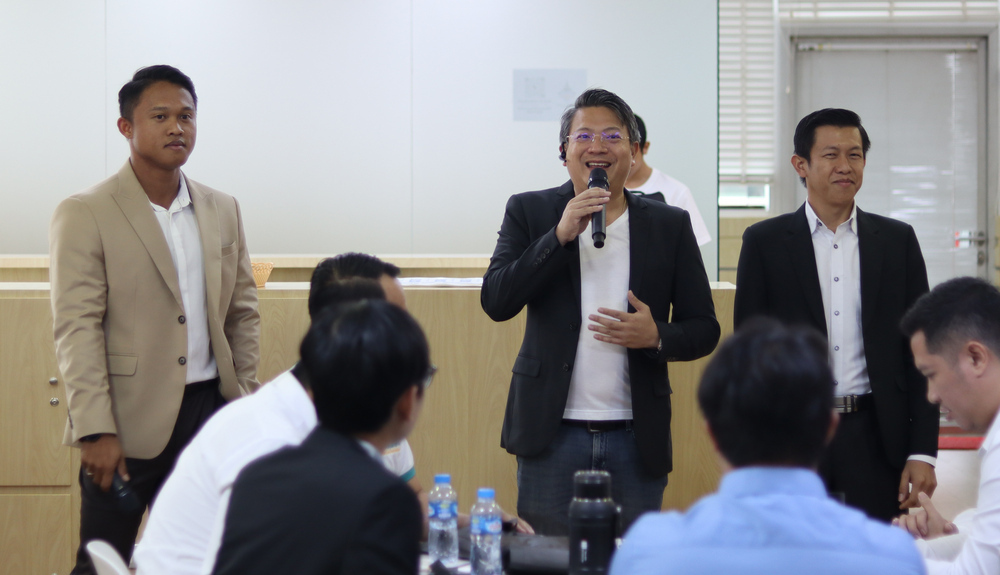
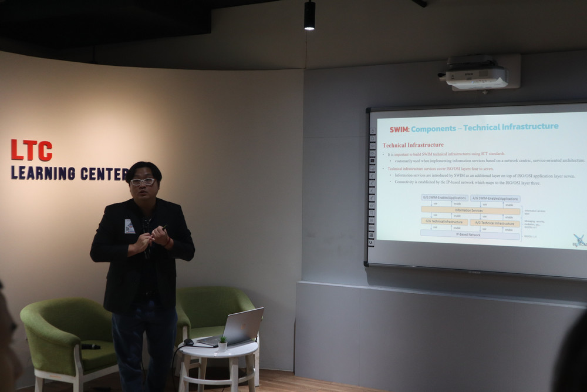
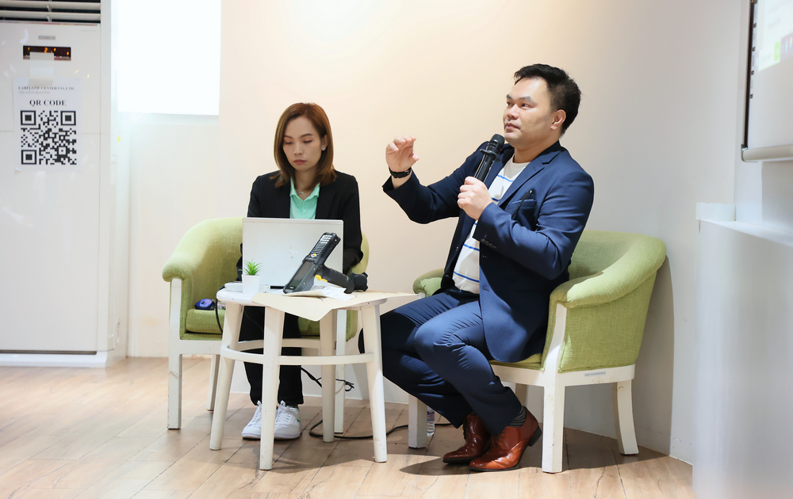

## SysAdmin Day ***2024*** - Live in Vientiane : Multiverse of Cybersecurity
# **(*Friday*) July 26, 2024**
### Location : [Lao Telecom Co-Working Space - 9th Floor, Lao Telecom (HQ) - Saylom Road](https://maps.app.goo.gl/uKV73P7cQy7GqbCF6)

    

    [ <a target="_blank" href="http://www.google.com/calendar/event?action=TEMPLATE&dates=20240726T014500Z%2F20240726T094500Z&ctz=Asia/Vientiane&text=SysAdmin%20Day%202024%20%3A%20Live%20in%20Vientiane&location=TBD&details=For%20details%2C%20link%20here%3A%20https%3A%2F%2FSysAdminDay.github.io%2F2024%2FVTE"><b>Google Calendar</b></a> ]
    [ <a target="_blank" href="./SysAdminDay2024-VTE.ics"><b>iCalendar</b></a> ]

 

    

---

+ **Kick-off**
    + Souksawat (Jack) Soulivanh, EX-TEC
    + Dr. Veerasith (Petch) Wongkarn
    + Bounkong (Boy) Chanthavi, Verisette Lao

    

---

+ **Easy way(s) to improve (y)ourself & boost (y)our career(s) at low cost w/ IT Cert(s)**
    + Maykin Warasart
    + Microsoft MVP - Security
    + [ISC2 CC](https://www.isc2.org/landing/1mcc), [CloudNetX](https://www.comptia.org/certifications/become-a-subject-matter-expert/comptia-cloudnetx-beta-exam)

    

---

+ **Cybersecurity in an AI-turbocharged era**
    + Asst.Prof. Wanchanok Sunthorn
        + Digital Media Technology Program, Rajamangala University of Technology Thanyaburi (RMUTT)
        + PhD candidate in Data Science and Artificial Intelligence, School of Engineering and Technology. Asian Institute of Technology (AIT)
    + Maykin Warasart
        + Founding President, iKNEX (Thailand)

    

---

+ **Building a CSOC and incident response cases**
    + Thongsavanh VILAYVONG
        + Tier 2 Cyber Specialist
    + Alee XAYKAOTHOR 
        + Deputy Chief of LTC CSOC

    

---

+ **Airside - System Wide Information Management (SWIM)**
    + Noppadol PRINGVANICH 
        + BearCat

    

---

+ **Designing a Wireless Network: Key Considerations for Success**
    + Prakasit Chaisiripongsakon 
        + MTTP

    

---

+ **Hands-on workshop with IP-COM Cable-Free Solution**
    + Prakasit Chaisiripongsakon
        + MTTP

    

---

+ **The risk of not having administrative control** -- **[Slide](Slides/Administrative_Control.pdf)**
    + Angkarn Pummarin (Man) 
        + Deputy Managing Director, TNET IT Solution

    

---

+ **The starting point to protect against cyber attacks with threat intelligence** -- **[Slide](Slides/Threat-Intelligence.pdf)**
    + Jedsada Thongkanluang 
        + Managing Director, TNET IT Solution 

    

---

+ **Barcode Solution**
    + Thana Sangsakul 
        + LabelOne Center 

    

---

+ **Internet of Life**
    + Meedam Phongthai 
        + Internet Infrastructure Specialist, MKS

    

---

+ **The new generation of Walkie Talkie**
    + Sayphet KEOVANXAY 
        + Spender Sales Specialis

    

---

    

#### More info: 
+ Mouk, Doungtavanh Thatsaphone (020 5909 0095)
+ Jack EX TEC [(WhatsApp)](https://wa.me/qr/ZIXUWJ53MMJBP1)
+ Boy, Verisette Lao 
+ Maykin, VolunteX by iKNEX 

#### Our supporter(s)

       
     
     
    

 
---

* SysAdminDay 2023, [Live in Vientiane](/2023/VTE)
* SysAdminDay 2023, [Virtual Event](/2023/VirtualEvent)
* [SysAdminDay 2022](/2022/VirtualEvent), Virtual Event
* [SysAdminDay 2021](/2021/VirtualEvent), Virtual Event
* [SysAdminDay 2020](/2020/VirtualEvent), Virtual Event
* [SysAdminDay 2019](/2019/Laos) at Lao PDR
* [SysAdminDay 2017](https://www.facebook.com/sysadminthailand/photos/?tab=album&album_id=303193886821648), Powered by [Netway Communication](https://netway.co.th/)

