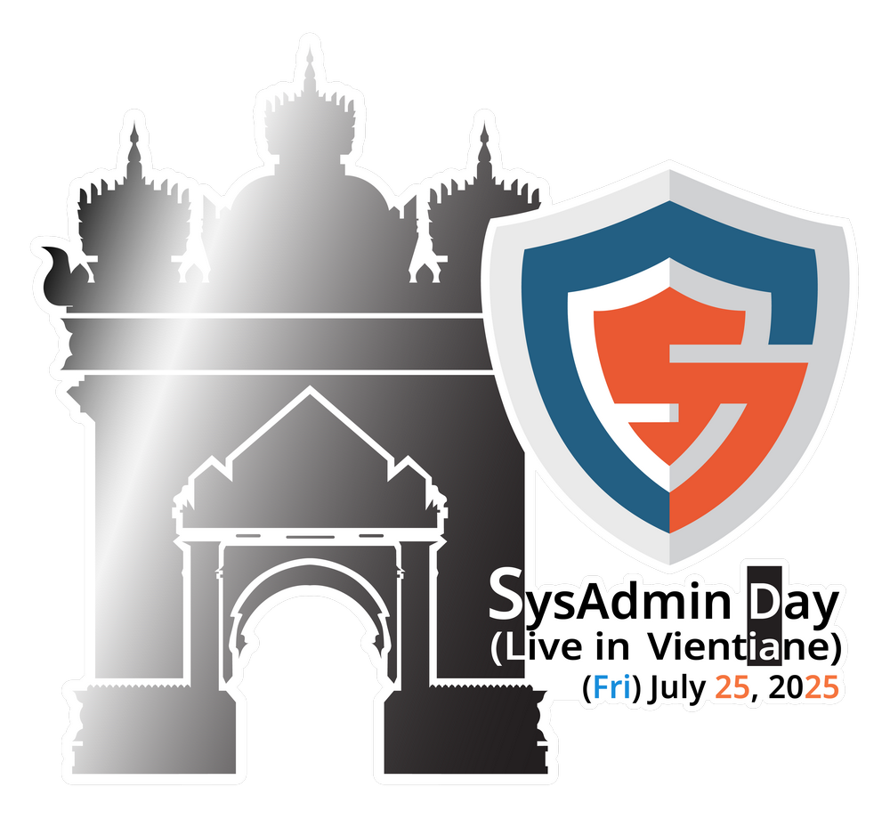
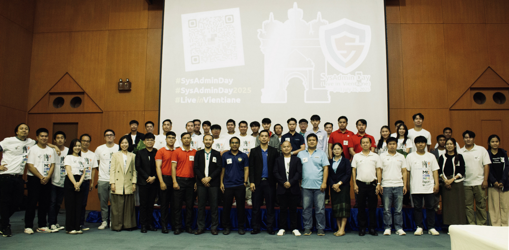
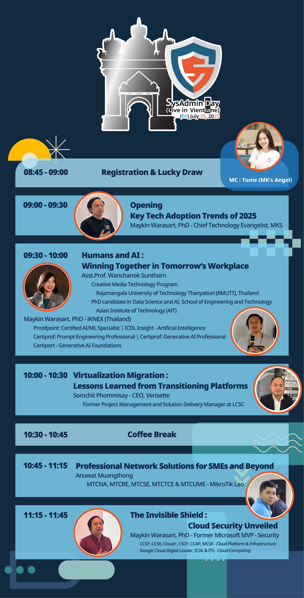
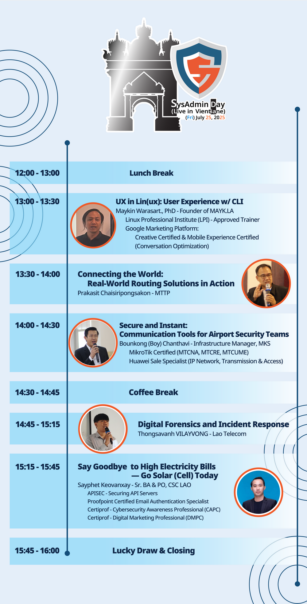
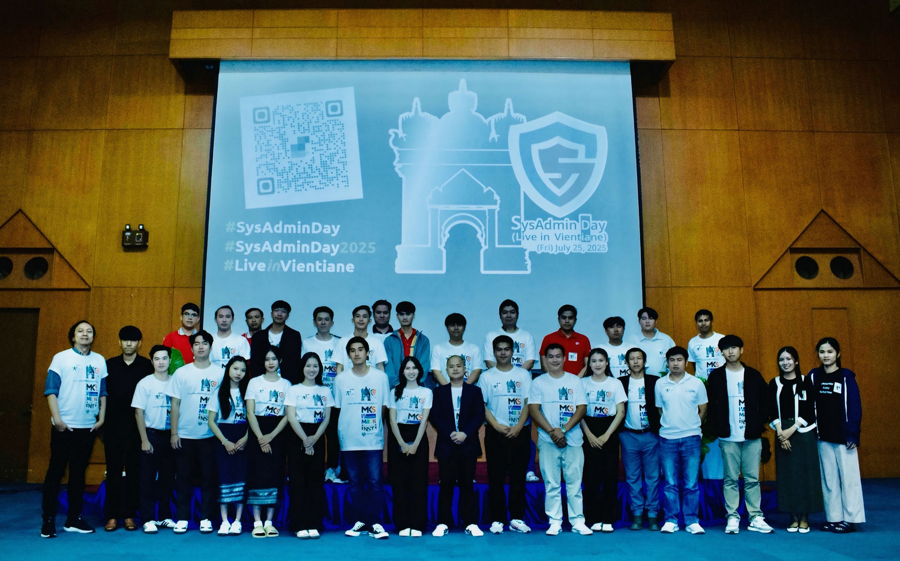

## SysAdmin Day ***2025*** - Live in Vientiane
# **(*Friday*) July 25, 2025**
### Location : ICTC Lao-Japan - [Map](https://maps.app.goo.gl/bwnDzqPgzep7d8YJ8)

    

    

---

    [ <a target="_blank" href="http://www.google.com/calendar/event?action=TEMPLATE&dates=20250725T014500Z%2F20250725T094500Z&ctz=Asia/Vientiane&text=SysAdmin%20Day%202025%20%3A%20Live%20in%20Vientiane&location=TBD&details=For%20details%2C%20link%20here%3A%20https%3A%2F%2FSysAdminDay.github.io%2F2025%2FVTE"><b>Google Calendar</b></a> ]
    [ <a target="_blank" href="./SysAdminDay2025-VTE.ics"><b>iCalendar</b></a> ]

    [ <a target="_blank" href="http://www.google.com/calendar/event?action=TEMPLATE&dates=20250725T014500Z%2F20250725T094500Z&ctz=Asia/Vientiane&text=SysAdmin%20Day%202025%20%3A%20Live%20in%20Vientiane&location=TBD&details=For%20details%2C%20link%20here%3A%20https%3A%2F%2FSysAdminDay.github.io%2F2025%2FVTE"><b>Google Calendar</b></a> ]
    [ <a target="_blank" href="./SysAdminDay2025-VTE.ics"><b>iCalendar</b></a> ]

---

#### More info: 
+ [Boy](https://api.whatsapp.com/send?phone=8562054485937)
+ [Chit](https://api.whatsapp.com/send?phone=8562059720444)
+ [Mouk](https://api.whatsapp.com/send?phone=8562052026253)

    

 

### Our supporter(s)

        
       
     
     
     

 
---

* SysAdminDay 2024, [Live in Vientiane](/2024/VTE)
* SysAdminDay 2023, [Live in Vientiane](/2023/VTE)
* SysAdminDay 2023, [Virtual Event](/2023/VirtualEvent)
* [SysAdminDay 2022](/2022/VirtualEvent), Virtual Event
* [SysAdminDay 2021](/2021/VirtualEvent), Virtual Event
* [SysAdminDay 2020](/2020/VirtualEvent), Virtual Event
* [SysAdminDay 2019](/2019/Laos) at Lao PDR
* [SysAdminDay 2017](https://www.facebook.com/sysadminthailand/photos/?tab=album&album_id=303193886821648), Powered by [Netway Communication](https://netway.co.th/)

### Confirmed Topics:
- "Key Tech Adoption Trends of 2025", Maykin Warasart, PhD.
- "Humans and AI: Winning Together in Tomorrow’s Workplace", Asst.Prof.Wanchanok Sunthorn & Dr.Maykin Warasart
- "Virtualization Migration: Lessons Learned from Transitioning Platforms", Somchit Phommisay
- "Professional Network Solutions for SMEs and Beyond", Anuwat Muangthong
- "The Invisible Shield: Cloud Security Unveiled", Maykin Warasart, PhD.
- "UX in Lin(ux): User Experience w/ CLI", Maykin Warasart, PhD.
- "Connecting the World: Real-world Routing Solutions in Action", Prakasit Chaisiripongsakon
- "Secure and Instant: Communication Tools for Airport Security Teams", Bounkong Chanthavi
- "Digital Forensics and Incident Response (DFIR)", Thongsavanh Vilayvong
- "Say Goodbye to High Electricity Bills—Go Solar (Cell) Today", Sayphet Keovanxay 