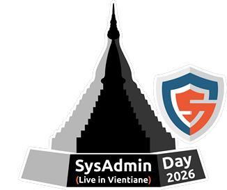
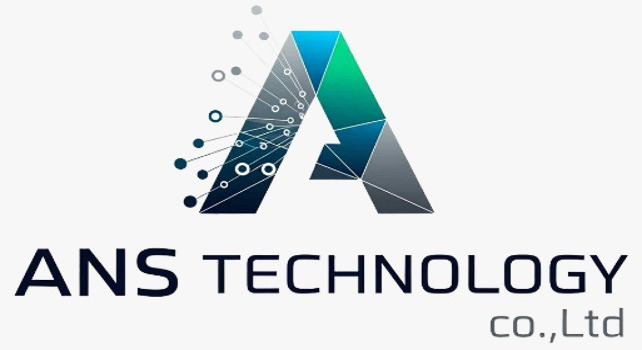
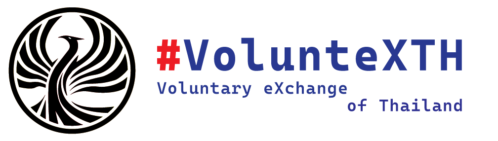

## SysAdmin Day ***2026*** - Live in Vientiane
### **(*Friday*) July 31, 2026**
### Location : Lao Digital Park (LDP) - [Map](https://maps.app.goo.gl/Bn83rof8AqxBoyP69)

    

 

---

    [ <a target="_blank" href="http://www.google.com/calendar/event?action=TEMPLATE&dates=20260731T014500Z%2F20260731T094500Z&ctz=Asia/Vientiane&text=SysAdmin%20Day%202026%20%3A%20Live%20in%20Vientiane&location=https://maps.app.goo.gl/ypE3JUx2bcqvq4U46&details=For%20details%2C%20link%20here%3A%20https%3A%2F%2FSysAdminDay.github.io%2F2026%2FVTE"><strong> Google Calendar</strong></a> ]
    [ <a target="_blank" href="./SysAdminDay2026-VTE.ics"><b> iCalendar</b></a> ]

## Topics

+ **Opening Speech:** ***"When AI Becomes the Prefix in Cybersecurity"***
	+ [Maykin Warasart](https://www.google.com/search?q=%22Maykin+Warasart%22), *PhD*
		+ *Field CIO & Technology Advocate, Verisette*
        + *Former Ministry CSOC Manager*

+ **"Your New Coworker Doesn't Sleep: Living with AI Agents in IT Ops"**
	+ [Asst.Prof.Wanchanok Sunthorn](https://www.google.com/search?q="วรรณชนก สุนทร")
		+ *Creative Media Technology Programme, Rajamangala University of Technology Thanyaburi (RMUTT)*
		+ *PhD candidate in Data Science and Artificial Intelligence, School of Engineering and Technology. Asian Institute of Technology (AIT)*
	+ [Maykin Warasart](https://www.google.com/search?q=%22Maykin+Warasart%22), *PhD*
		+ *AI Advocate, MBro Global*
		+ *Proofpoint Certified* ***{*** *AI/ML, AI Agent Security, AI Data Security* ***}*** *Specialist, CompTIA SecAI+, ISTQB - CT-GenAI, CPRE - AI4RE*

+ **"Linux Isn't Boring Anymore"**
	+ [Chit Phommisay](https://www.facebook.com/jid.phommixay.7)
		+ *General Manager, Telcoms Solution*
        + *Former Project Management & Solution Delivery Manager at LCSC*
	+ [Maykin Warasart](https://www.google.com/search?q=%22Maykin+Warasart%22), *PhD*
		+ *[Approved Trainer, Linux Professional Institute (LPI)](https://people.lpi.org/m/848713d8-e33b-44bd-9590-1bc3e2355e1b)*
        + *[Former Microsoft MVP](https://www.credly.com/badges/be03be84-65a7-4803-b793-005330bc0daf) (Security, Cloud and Datacenter Managerment)*

+ **"Digital Forensics After Real-World Cyber Incidents"**
	+ [Thongsavanh Vilayvong](https://www.facebook.com/profile.php?id=100050492919052)
		+ *Deputy CSOC Manager, Lao Telecom*

+ **""**
	+ Xong
	+ Sayphet Keovanxay
		+ *Product Owner, Verisette Dev Team (previously CSCLAO)*

+ **"Low-Cost AI Information Security Governance Architecture"**
	+ [Angkarn Pummarin](https://www.google.com/search?q="อังคาร ภุมรินทร์")
		+ *Deputy Managing Director, TNET-IT Solution*

## Activities
+ **Linux Corner:** Linux **Lovers**' Clinic
	    
+ **Pokémon Trainer Meetup:** Let's Celebrate the **10th Anniversary** of **Pokémon GO**
    + *Show me the* **buddy** *!!!*
    

## Special Gift
+ **SecAI+** Courseware
	+ **5 accounts** will be given to the **first 5 people** who arrive
	+ **5 or more accounts** will be given away in a **lucky draw during the event**

    [ <a target="_blank" href="http://www.google.com/calendar/event?action=TEMPLATE&dates=20260731T014500Z%2F20260731T094500Z&ctz=Asia/Vientiane&text=SysAdmin%20Day%202026%20%3A%20Live%20in%20Vientiane&location=https://maps.app.goo.gl/ypE3JUx2bcqvq4U46&details=For%20details%2C%20link%20here%3A%20https%3A%2F%2FSysAdminDay.github.io%2F2026%2FVTE"><strong> Google Calendar</strong></a> ]
    [ <a target="_blank" href="./SysAdminDay2026-VTE.ics"><b> iCalendar</b></a> ]

---

#### More info: 
+ [Mouk](https://api.whatsapp.com/send?phone=8562052026253)
+ [Boy](https://api.whatsapp.com/send?phone=8562054485937)
+ [Chit](https://api.whatsapp.com/send?phone=8562059720444)

#### Our Supporter:

       
      
    <</a>  
     
     

#### Pass Events: 
* SysAdminDay 2025, [Live in Vientiane](/2025/VTE)
* SysAdminDay 2024, [Live in Vientiane](/2024/VTE)
* SysAdminDay 2023, [Live in Vientiane](/2023/VTE)
* SysAdminDay 2023, [Virtual Event](/2023/VirtualEvent)
* [SysAdminDay 2022](/2022/VirtualEvent), Virtual Event
* [SysAdminDay 2021](/2021/VirtualEvent), Virtual Event
* [SysAdminDay 2020](/2020/VirtualEvent), Virtual Event
* [SysAdminDay 2019](/2019/Laos) at Lao PDR
* [SysAdminDay 2017](https://www.facebook.com/sysadminthailand/photos/?tab=album&album_id=303193886821648), Powered by [Netway Communication](https://netway.co.th/)
